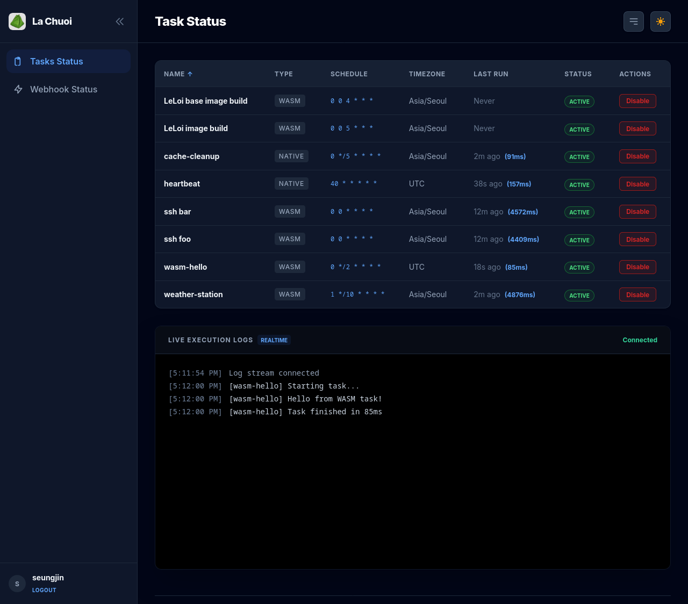

# La Chuoi - WASI Runtime & Service Framework

> [!NOTE]
> The original Spin Framework and GPLv4-based code have been moved to the `legacy-gpl-version` branch. This is a new implementation of La Chuoi built from scratch: a Wasmtime-based WASI runtime framework licensed under MIT/Apache 2.0.

Project LACHUOI is named after the Vietnamese word *lá chuối*, meaning "banana leaf."

<div align="center">
  
  <p><em>Modern, responsive dashboard featuring real-time task monitoring and controls.</em></p>
</div>

A high-performance, distributed WASI runtime and task management engine built with Rust. Beyond traditional **cron-based scheduling**, La Chuoi serves as a comprehensive **WASI runtime environment** capable of hosting web services, processing webhooks, and executing sandboxed components with full **WASI-HTTP** support.

## 🚀 Key Features

- **Hybrid Execution**: Run native Rust tasks or secure, sandboxed WASM components.
- **Web Services & Webhooks**: Integrated support for receiving and processing webhooks, enabling event-driven task execution and web-based servicing.
- **Universal WASI Runtime**: Full support for WASI Preview 1 and the modern Component Model (Preview 2).
- **WASI-HTTP Support**: Sandboxed components can perform secure outbound HTTP requests and participate in web-based workflows.

### 🎨 Modern Dashboard & Theme Support
<div align="center">
  
</div>

- **Dark/Light Theme**: Built-in support for system-preferred or manual theme switching.
- **Real-time Monitoring**: Live execution logs and status updates via Server-Sent Events (SSE).
- **Interactive Controls**: Enable, disable, and sort tasks directly from the web UI.

- **Remote WASM**: Download WASM binaries directly from HTTPS URLs with mandatory verification.
- **WASM Security**: Mandatory SHA256 checksum verification for all WASM binaries (local or remote).
- **Persistent State**: Database-backed sessions, execution history, and webhook logs (Turso/libSQL).
- **Zero-Downtime Reloads**: Hot-reload `cron.toml` configuration without stopping the service.

---

## 🛠️ Prerequisites

- **Rust**: Latest stable version (1.81+ recommended).
- **Database**: A Turso account or a local libSQL/SQLite file.
- **GitHub OAuth App**: For secure dashboard authentication.

---

## ⚙️ Configuration

### 1. Environment Variables
Create a `.env` file in the root directory:

```bash
# Database Configuration
TURSO_DATABASE_URL="libsql://your-db.turso.io" # Or local path: "tasks.db"
TURSO_AUTH_TOKEN="your-secret-token"           # Only for remote Turso

# GitHub OAuth
GITHUB_CLIENT_ID="your_client_id"
GITHUB_CLIENT_SECRET="your_client_secret"
GITHUB_REDIRECT_URL="https://your-domain.com/auth/github/callback"
```

### 2. Task Configuration (`cron.toml`)
Define your tasks in `cron.toml`. Changes can be reloaded at runtime.

```toml
# Native Rust Task
[[task]]
name = "heartbeat"
cron = "0 * * * * *"
timezone = "UTC"
type = "native"

# WASM Plugin Task (Local)
[[task]]
name = "weather-station"
cron = "0 */10 * * * *"
timezone = "Asia/Seoul"
type = "wasm"
payload = "weather.wasm"
sha256 = "ad677d5c7c136f862aed95f61879d0b0bb80cfb6f9921..."
args = ["--city", "Seoul"]

# WASM Plugin Task (Remote)
[[task]]
name = "github-stats"
cron = "0 0 * * * *"
timezone = "UTC"
type = "wasm"
payload = "https://example.com/plugins/github.wasm"
sha256 = "b5bb9d8014a0f9b1d61e21e796d78dccdf1352f23cd328..."

```

---

## 🏃 Running the Application

### Build and Run
```bash
cargo run --release
```

### Zero-Downtime Reload
If you modify `cron.toml`, you can reload the configuration without restarting the service:
```bash
./lachuoi reload
```
*This sends a SIGHUP signal to the main process via its PID file.*

---

## 🧩 Architecture

### Native Handlers
Native tasks are modularized in `src/native_handlers.rs`. These are compiled directly into the binary for performance-critical logic.

### WASM Runtime & Services
WASM tasks and services run in a strictly sandboxed environment using **Wasmtime**.
- **SHA256 Check**: The scheduler verifies the binary hash before every execution.
- **WASI-HTTP**: Components can interact with external web services securely.
- **Webhook Integration**: Inbound webhooks are logged and can be used to trigger specific task logic.
- **Argument Resolution**: Supports dynamic argument injection (e.g., `file:~/.ssh/id_ed25519` or `env:VAR_NAME`).
- **Standard Output**: Logs are captured via `PrefixPipe` and streamed to the UI in real-time.

---

## 🖥️ Web Dashboard

Accessible at `http://localhost:9130` (default port).

- **Monitoring**: View all tasks, their schedules, and real-time status.
- **Sorting**: Click any column header to sort tasks.
- **Controls**: Enable or disable tasks directly from the UI.
- **Live Logs**: View the last 1000 lines of execution logs in the real-time console.
- **Webhook Logs**: Track incoming webhook requests and payloads in the database.

---

## 📦 Deployment

The project includes a `Containerfile` for Docker/Podman deployment:
```bash
podman build -t lachuoi .
podman run -p 9130:9130 --env-file .env lachuoi
```

---

## 📄 License
MIT or Apache 2.0. Copyright (c) 2026 Seungjin Kim.
